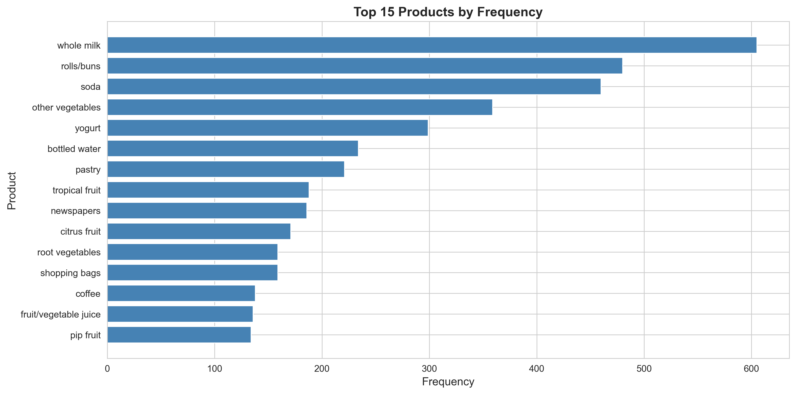
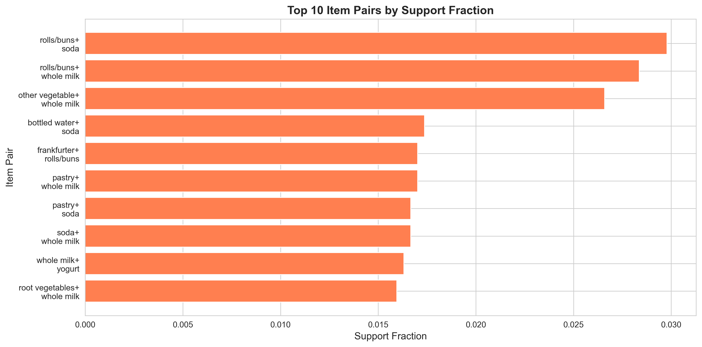
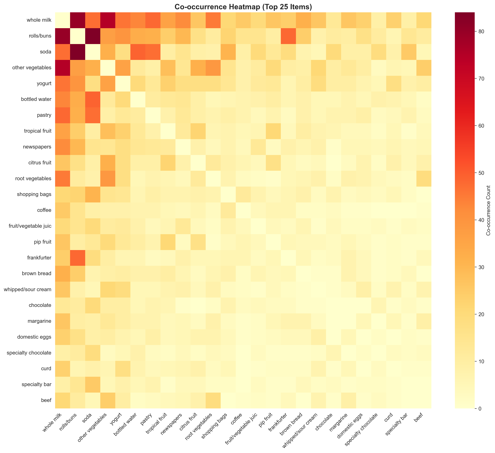
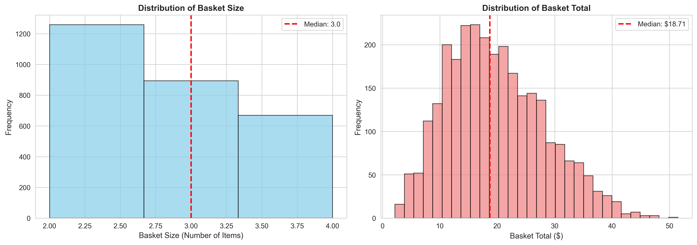

## Report

### Design and Data Model

The `groceries.csv` file holds 4472 transactions. Each line is a comma-separated list drawn from 149 product names, like `soda,yogurt`, for one transaction. Basket sizes run from 1 to 4 items.

After cleaning plus transformation, each transaction looks like this. `transaction_id` is an integer that counts up from 0 to N-1. `basket_size` is an integer for the number of items in the basket. `items` is a list of standardized, lowercase product names. `basket_total` is a floating-point sum of item prices in USD.

We also keep a few helpers. `price_dict` maps each product to a random price between $0.50 and $15.00. `pair_counter` tracks counts for every item pair, plus `triple_counter` for every triple.

### How we did it

We kick off by cleaning the raw text. All names go lowercase for consistency. We trim leading plus trailing whitespace. We drop empty strings and nulls. Then we remove all single-item transactions, which cuts 1652 baskets.

Why a minimum basket size of two? Solo items cannot form pairs, so they add no co-occurrence signal. The final dataset lands at 2820 transactions.

Next, we enable revenue views. Each unique product gets a random unit price from $0.50 to $15.00 with a fixed seed so results repeat. Basket totals are the sum of those prices per transaction, assuming quantity equals 1 or that items are unique.

Then we analyze co-occurrence. We set a minimum support count of 20, so pairs or triples below 20 baskets drop out. We also keep a top-K of 10 to spotlight the most frequent pairs plus triples.

We speed things up with `itertools.combinations` to avoid duplicate pair generation. We use `collections.Counter` for constant-time (O(1)) increments when tallying frequencies.

### What we see

Key stats paint the scene. Total transactions analyzed: 2820 after filtering. Unique products: 146 after cleaning. Median basket size: 2 items. 95th percentile basket size: 4 items. Mean basket total: $19.73. Median basket total: $18.71.

Popular items jump out like magnets. Whole milk shows up 726 times, soda 616, plus rolls/buns 589. Dairy, beverages, plus bakery staples dominate, which fits everyday grocery runs. Example: quick sandwich fix - rolls/buns plus soda.

Across 2562 unique item pairs, 51 pairs clear the 20-basket bar. Strongest ties link beverages with baked goods or dairy. The pair (rolls/buns, soda) suggests meal-replacement shopping. Whole milk acts like an anchor item, pairing often with many others.

No triples cross the 20-basket mark. Three-item combos are rare in this dataset.

Basket sizes skew right, with most baskets at two items. Basket totals look roughly normal around $18–$20, with a longer right tail from occasional higher-value shops. Once, a late-night dash for rolls plus soda saved dinner.

### Limits + next steps

Small baskets limit multi-item pattern discovery, so the median of two caps complexity. We lack timestamps, so no trends over time or seasonal effects yet. We assume quantity equals 1, so true quantities remain unknown. Prices are random, so real-world price bias is not captured.

The 20-basket support was a balance: enough data for reliability plus room to spot patterns. If we lower it, we will see more associations, though with less confidence.

For future work, we could add association rules to compute confidence plus lift for direction plus strength. If we can get timestamps, then break results out by weekday, season, or trend. With customer IDs, we could cluster shoppers to find segment-specific patterns.

### Bottom line

This market basket analysis surfaces clear complements: beverages like soda or bottled water plus bakery or dairy staples such as rolls/buns or whole milk and yogurt. The result suggests practical, complementary behavior at checkout.
